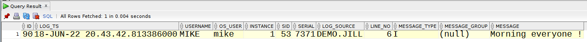
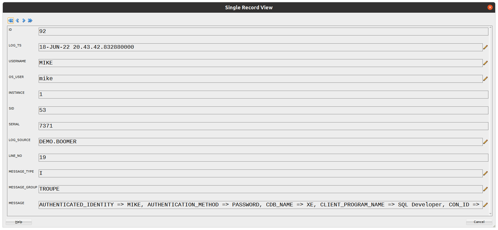
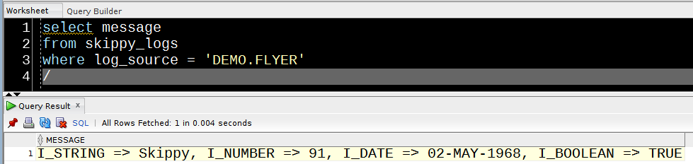
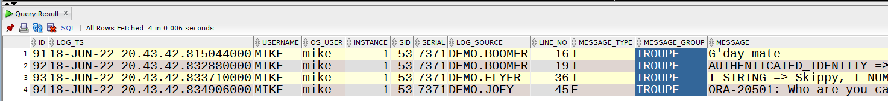
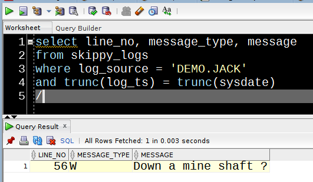

# Using Skippy

The package *demo* contains the code used in the following examples.
You can deploy this package using the source code in this directory.
- demo.pks is the package header
- demo.pkb is the body.

You can run all procedures in the package by running :

```sql
set serverout on
exec demo.run_all;
```
Note that you will see an error when you run this :

```
ORA-20511: Your finger, you fool!
ORA-06512: at "MIKE.DEMO", line 62
```
This is the value returned by a call to the SKIPPY.GET_ERR function in the package.


## Logging

Skippy will automatically log the source (object, package member and line number) of a call to it, as well as the log message itself. To log a message :

```sql
skippy.log('Morning everyone !');
```



To capture userenv parameter settings :

```sql
skippy.env;
```



To log the current error stack :

```sql
skippy.err;
```
Alternatively, you can retrieve the current error stack into a variable :
```sql
v_message := skippy.get_err;
```

To record a list of parameter values, you can use the ADD_PARAM procedure to build the list. 
Parameters of type VARCHAR2, DATE, NUMBER and BOOLEAN are supported :

```sql

        skippy.add_param( 'I_STRING', i_string, v_paramlist);
        skippy.add_param( 'I_NUMBER', i_number, v_paramlist);
        skippy.add_param( 'I_DATE', i_date, v_paramlist);
        skippy.add_param( 'I_BOOLEAN', i_boolean, v_paramlist);

        skippy.log( v_paramlist);
```


## Grouping Messages

You can assign messages to a group. This can be useful if you are running a batch process which invloves calls to a number of database objects.

You can either assign a message to a group explicitly...

```sql
skippy.log('No worries', i_group=> 'TROUPE');
```
...or you can set the group at session level, after which all logs will be assigned to the group :

```sql
skippy.set_msg_group('TROUPE');
```



## Logging Level

Logging levels in Skippy are configurable. They are managed in the table SKIPPY_MESSAGE_TYPES.

Skippy supports four logging levels out-of-the-box :
- E(rror)
- W(arning)
- I(nformation)
- D(ebug)
- A(ll) - the default  
  
  To set the logging level for a session :

```sql
        skippy.set_log_level('W');
        -- ...means that this message will not be logged
        skippy.log(q'[What's that Skippy ?]');
        -- ...but this one will
        skippy.log('Down a mine shaft ?', 'W');
```
This will ensure that only Warning and Error messages are recorded.



To turn logging off altogether in the current session :
```sql
skippy.disable_logging;
```

## Show current settings

To see the message group that's currently set in the session :

```sql 
select skippy.current_setting('group') from dual;
```

To see the current logging level :

```sql
select skippy.current_setting('level') from dual;
```
