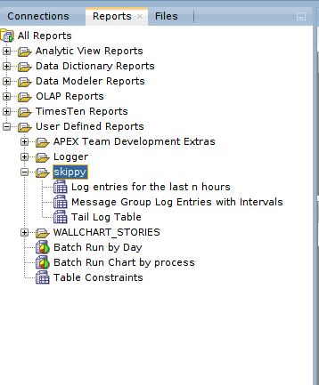

# Skippy - A simple PL/SQL Logging Framework

Skippy is a simple logging framework for PL/SQL.
It's simple because :

- it will log details of the location it was called from without additional input
- it consists of only a few database objects
- it can be installed in an existing schema - no exotic privileges or object grants required
- only standard Oracle features are used - no additional licensing considerations
- it's compatible with Oracle 11gR2 and later.

## Installation

Connect to the database schema that you want to install the framework in.
Run the installation script :

```sql
@install.sql
```

To confirm installation, run the following :

```sql
select object_name, object_type, status
from user_objects
where object_name like 'SKIPPY%'
order by object_type, object_name
/
```

The framework objects reported should be :

| Object Name | Object Type | Status |
| ----------- | ----------- | ------ |
| SKIPPY_LOGS_PK | INDEX | VALID |
| SKIPPY_MESSAGE_TYPES_PK | INDEX | VALID |
| SKIPPY_USERENV_PARAMETERS_PK| INDEX | VALID |
| SKIPPY | PACKAGE | VALID |
| SKIPPY | PACKAGE BODY | VALID |
| SKIPPY_LOGS_ID_SEQ | SEQUENCE | VALID |
| SKIPPY_LOGS | TABLE | VALID |
| SKIPPY_MESSAGE_TYPES | TABLE | VALID |
| SKIPPY_USERENV_PARAMETERS | TABLE | VALID |
| SKIPPY_ENV | VIEW | VALID |

## Usage

Skippy will automatically record the location (object, package member and line number) it's called from. All you need to do is give it a message :

```sql
skippy.log('Morning everyone !');
```


See  [the demo folder](demo/usage.md) for further usage details.
## Installing SQLDeveloper Reports ##

If you're using SQLDeveloper, you can install the Skippy SQLDeveloper Reports suite, which consists of three reports :

- Log entries for the last *n* hours
- Message Group Log Entries with Intervals between each message
- Tail of the Log Table

Installation requires the standard steps for importing reports into SQLDeveloper, i.e. :

1. Open the *Reports* tab in SQLDeveloper. 
2. Right-click the *User Defined Reports* node and select *Open Report*
3. Select the file *sqldeveloper_reports/skippy_sqld_reports.xml* and click *Open*

This will create a node called *Skippy* under *User Defined Reports*



## Tests
The repository includes a suite of tests written using the utPLSQL 3.x framework.
You can [find utPLSQL here.](https://github.com/utPLSQL/utPLSQL)
With utPlSQL installed, you can execute the tests by deploying the test packages and then running the script :

```
run_all_tests.sql
```
## Why call it Skippy ?

In honour of "Uncle Steve". You can [read the full story here.](https://wp.me/pweWl-1Db)
